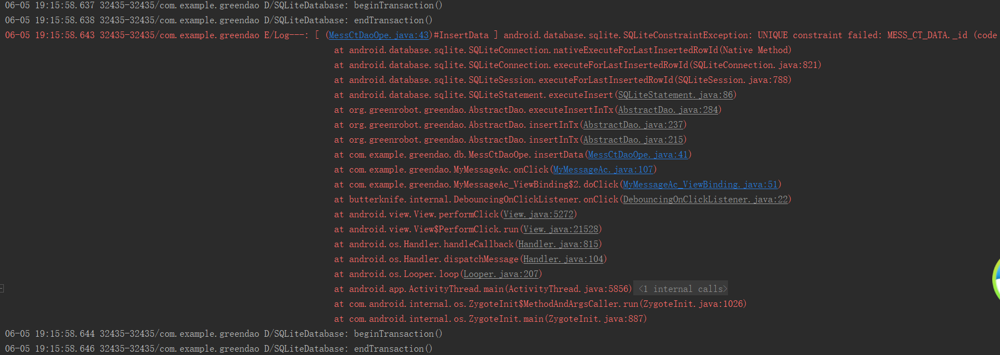

#### 下面是数据库GreenDao的操作界面
<div>
<p>在首页和我的消息界面可以操作数据库，点击更多案例可以进入我的消息界面</p>


</div>

<div>
<p>点击“新增偏航数据”按钮后，进入行程提醒界面可看到新增的数据。<br>再次点击“新增偏航数据”按钮后，新城提醒界面数据更新可进入查看</p>
<p>执行的方法为：insertOrReplaceData，如果新增数据id已经存在就会覆盖之前的数据。</p>
 
</div>

<div>
<p>点击“新增推荐数据”按钮后，进入精彩推荐和景点播报界面可看到新增的数据。<br>再次点击“新增推荐数据”按钮后，数据不更新内部方法已经报错。</p>
<p>执行的方法为：insertData，如果新增数据id已经存在则会报错。</p>
 

</div>

<div>
<p>点击“新增推荐数据”或者“新增推荐数据”按钮后，都会将json数据保存到数据库。<br>可以进入导引消息界面查看。</p>
<p>执行的方法为：insertData，新增数据id会按序增加。</p>
 

</div>

```
@Entity
public class JsonStrData {
    @Id(autoincrement = true)
    private Long id;
}
JsonStrDaoOpe.insertData(mContext, new JsonStrData(null, getLocalStr("WuWCData.json")));
```

#### 使用insertData方法，如果数据库存在对应的id值会报下面的错。使用insertOrReplaceData方法则会将id相同的数据进行更新

<hr/>
